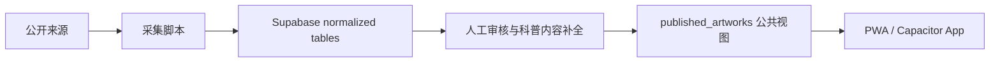

# 数据采集管线

## 目标架构



## 来源策略

### Art Institute of Chicago

- 优先使用官方 API，不爬网页。
- API 元数据大多为 CC0；描述字段可能需要保留署名和来源。
- 图片通过 IIIF URL 引用，不把图片文件直接塞进数据库。
- 公开领域记录可以写入 `published`。

### Artvee

- 只导入 `.env` / shell 环境中明确列出的 artwork 页面。
- 只抓取 Open Graph 标题、描述、图片和来源 URL。
- 默认写入 `draft`，发布前必须人工核验原始来源、作者、年代、许可证和下载权限。
- 不做并发抓取；脚本内保留低频等待。

## Supabase Ingestion

Chicago Art Institute public-domain import:

```bash
npm.cmd run db:ingest:artic
```

Artvee low-frequency draft import:

```powershell
$env:ARTVEE_URLS="https://artvee.com/..."; npm.cmd run db:ingest:artvee
```

Artvee records remain `draft` until source, rights status, artist, date, and image quality are manually reviewed in Supabase.

## 发布规则

- `artworks.status = 'published'` 才会进入前端公开视图。
- `is_public_domain = true` 才应该展示高清下载入口。
- 不确定权利状态的记录保留为 `draft`。
