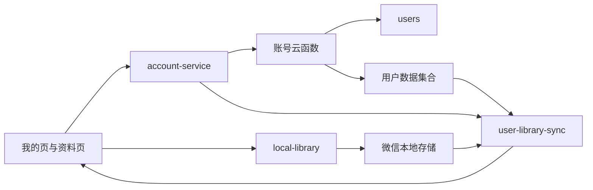

# Masterpiece 小程序“我的”页账号中心执行计划

**文档状态：** 已确认，待逐项执行  
**制定日期：** 2026-07-26  
**实施范围：** 仅 `miniapp/` 微信原生小程序  
**对应长期路线：** `2026-07-16-wechat-native-capability-roadmap-design.md` 的全局 P2  
**首版目标：** 完成账号专项 P0 和 P1；账号专项 P2 在前两阶段稳定后实施

## 1. 目标

把当前以固定访客文案和本地缓存为主的“我的”页，升级为具备微信身份、个人资料、个人数据同步、隐私说明和数据管理能力的账号中心，同时保证：

- 未完善资料的用户仍可正常浏览全部公共内容。
- 当前本机收藏、关注画家、浏览历史和下载记录不丢失。
- 用户身份、头像昵称和行为数据按最小必要原则分开处理。
- 优先使用微信官方 API、原生组件和微信云开发能力。
- 不在小程序前端保存 AppSecret、云开发管理密钥或其他高权限凭据。
- 每个阶段都可以独立测试、验收和回滚。

## 2. 当前基线

### 2.1 已有能力

- `miniapp/app.js` 已通过 `wx.cloud.init` 接入生产云环境。
- “我的”页已有用户卡片、三项统计和菜单分区。
- 我的收藏、关注画家、浏览历史、下载管理页面均已存在。
- `miniapp/services/local-library.js` 已使用本地存储管理上述个人数据。
- 页面已有统一的浅色、圆角卡片和 Lucide 图标体系。

### 2.2 当前缺口

- “访客用户”“本地体验模式”和头像文字均为前端固定值。
- 没有用户集合、身份云函数和账号服务。
- 个人资料、实名认证、安全中心、会员特权均为占位入口。
- 本地收藏、关注和历史无法跨设备同步。
- 当前“退出登录”不对应真实账号状态，语义不准确。
- 尚未配置个人资料保存、隐私授权说明和账号注销流程。

## 3. 已确认的产品决策

1. **浏览不强制登录。** 首页、分类、画家和详情继续对游客开放。
2. **身份与资料分离。** 微信云身份用于识别用户；头像和昵称只在用户主动完善资料时获取。
3. **本地优先。** 收藏、关注和历史操作先落本地，再异步同步云端，弱网不能阻塞基本使用。
4. **首次同步默认合并。** 不静默覆盖本机或云端任意一侧的数据。
5. **下载文件不跨设备同步。** 云端最多保存可重建的下载元数据，不上传本地文件路径。
6. **首版不做实名认证。** 当前不存在必须实名的业务场景，该入口从首版账号中心移除。
7. **首版不强制绑定手机号。** 只有未来出现会员、交易或账号找回等明确需求时再评估。
8. **不伪造传统退出登录。** 没有独立账号会话前，将底部操作调整为“账号与数据”中的明确数据操作。
9. **会员特权继续暂缓。** 在会员业务、权益、支付与合规方案确定前不实现。
10. **账号数据默认自动同步。** 同一微信身份在手机、iPad 等设备进入同一小程序时，收藏、关注和历史自动合并；不设置面向用户的同步开关或单独同步入口。

## 4. 目标信息架构

### 4.1 用户卡片

用户卡片支持四种明确状态：

| 状态 | 主标题 | 辅助说明 | 主要操作 |
|---|---|---|---|
| 本地访客 | 访客用户 | 数据仅保存在当前设备 | 完善资料 |
| 身份建立中 | 读取中 | 正在建立小程序身份 | 不可重复点击 |
| 已识别、未完善 | 微信用户 | 账号数据自动同步 | 完善资料 |
| 已完善 | 用户昵称 | 显示同步状态或最近同步时间 | 查看个人资料 |
| 异常或离线 | 使用本地数据 | 云端暂不可用 | 重试 |

页面必须先显示本地状态和统计，再异步刷新云端状态，不能出现空白页或长时间无反馈。

### 4.2 菜单结构

```text
账户与数据
├─ 个人资料
├─ 隐私与授权
└─ 账号与数据

收藏与管理
├─ 我的收藏
├─ 关注画家
├─ 浏览历史
└─ 下载管理

系统设置
├─ 帮助与反馈
└─ 关于 Masterpiece
```

首版删除或隐藏：

- 实名认证
- 会员特权
- 语义不准确的“退出登录”

## 5. 技术架构



### 5.1 推荐服务边界

| 单元 | 责任 |
|---|---|
| `account-service` | 用户状态、资料读取、资料更新、错误归类 |
| `user-library-sync` | 首次合并、增量同步、冲突处理和重试 |
| `local-library` | 继续管理本机收藏、关注、历史和下载元数据 |
| 账号云函数 | 通过云函数上下文识别用户并执行受控读写 |
| 页面 | 展示状态、触发操作、反馈结果，不直接拼装安全逻辑 |

### 5.2 云端集合

#### `users`

```js
{
  _id: "cloud-document-id",
  _openid: "provided-by-cloud-context",
  nickname: "",
  avatar_url: "",
  profile_completed: false,
  sync_enabled: true,
  privacy_version: "",
  account_status: "active",
  schema_version: 1,
  created_at: "server-date",
  updated_at: "server-date",
  last_active_at: "server-date",
  last_sync_at: "server-date-or-null"
}
```

#### `user_favorites`

```js
{
  _openid: "...",
  artwork_id: "stable-artwork-id",
  created_at: "server-date",
  updated_at: "server-date",
  deleted: false,
  version: 1
}
```

#### `user_followed_artists`

```js
{
  _openid: "...",
  artist_id: "stable-artist-id",
  created_at: "server-date",
  updated_at: "server-date",
  deleted: false,
  version: 1
}
```

#### `user_history`

```js
{
  _openid: "...",
  artwork_id: "stable-artwork-id",
  viewed_at: "server-date",
  view_count: 1,
  deleted: false,
  version: 1
}
```

### 5.3 索引与权限原则

- `users` 使用服务端根据 `OPENID` 生成的确定性文档 ID 作为等价唯一约束；保留平台自动创建的 `_openid_1` 普通索引。
- 收藏对 `_openid + artwork_id` 建复合索引。
- 关注对 `_openid + artist_id` 建复合索引。
- 历史对 `_openid + artwork_id` 建复合索引，并对 `_openid + viewed_at` 建查询索引。
- 用户集合默认不公开。
- 账号和同步写入统一通过云函数完成。
- 云函数只信任 `getWXContext()` 得到的身份，不接受客户端传入的 `_openid`。
- 所有更新字段使用白名单，客户端不能修改账号状态、所有者和服务端时间。

## 6. 六个实施任务

## 任务 1：账号云基础与安全边界

**阶段：** 账号专项 P0  
**依赖：** 无  
**目标：** 建立可靠的微信身份、用户集合和服务端安全边界。

### 实施内容

1. 配置云函数根目录和账号云函数工程。
2. 使用云函数上下文获得当前用户 `OPENID`。
3. 实现幂等的 `getOrCreateProfile`。
4. 创建 `users` 集合、确定性用户文档 ID 和最小权限规则。
5. 建立统一返回结构和错误码。
6. 增加云函数单元测试和跨用户隔离测试。
7. 先在体验环境验证，再把同一结构部署到生产环境。

### 验收标准

- 同一微信用户重复调用只返回同一用户记录。
- 客户端伪造 `_openid` 不影响实际身份。
- 两个测试用户无法读取或修改对方资料。
- 云服务不可用时，小程序仍能进入本地访客模式。
- 不修改现有作品、画家和标签集合。

### 回滚边界

- 移除账号云函数调用即可恢复纯本地模式。
- 新建用户集合独立存在，不影响既有生产内容。

## 任务 2：小程序用户状态服务与“我的”页状态机

**阶段：** 账号专项 P0  
**依赖：** 任务 1  
**目标：** 页面不再依赖固定访客文案，并具备可解释的加载、成功、离线和失败状态。

### 实施内容

1. 新建 `account-service`。
2. 定义本地访客、识别中、已识别、已完善、离线和失败状态。
3. 本地缓存最近一次非敏感资料摘要。
4. “我的”页先显示本地统计，再异步刷新账号状态。
5. 调整用户卡片主文案、辅助说明和入口。
6. 调整菜单结构，移除实名认证、会员特权和假退出入口。
7. 为请求增加防重复提交、超时、重试和成功反馈。

### 验收标准

- 进入“我的”页立即可见本地收藏、关注和历史数量。
- 云端慢或离线时不出现空白页。
- 身份状态更新不造成页面闪烁或统计归零。
- 所有可点击区域不小于 44×44 像素。
- 未开放入口不伪装成可用功能。

### 回滚边界

- 用户卡片和菜单可以恢复到原本地版本。
- 不回滚 `local-library` 中已有用户数据。

## 任务 3：个人资料页与头像昵称

**阶段：** 账号专项 P0  
**依赖：** 任务 1、任务 2  
**目标：** 用户能够主动完善和更新头像昵称。

### 实施内容

1. 新建个人资料页面及路由。
2. 使用 `button open-type="chooseAvatar"` 选择头像。
3. 使用 `input type="nickname"` 填写昵称。
4. 上传头像到受控云存储目录。
5. 对昵称进行长度、空值和内容安全校验。
6. 通过账号云函数白名单更新资料。
7. 保存按钮在提交期间禁用并显示加载状态。
8. 保存成功后更新本地摘要和“我的”页卡片。

### 验收标准

- 用户不授权头像时仍可继续浏览。
- 昵称不合规时给出明确提示，不写入数据库。
- 连续点击保存不会产生重复记录。
- 头像上传失败时保留原头像。
- 再次进入小程序可以恢复已保存资料。
- Android、iOS 真机均完成头像昵称流程。

### 回滚边界

- 关闭个人资料入口不影响用户身份和本地数据。
- 云存储上传失败不会删除旧头像引用。

## 任务 4：收藏、关注和历史的云端同步

**阶段：** 账号专项 P1  
**依赖：** 任务 1 至任务 3  
**目标：** 在保留本地即时体验的同时提供跨设备同步。

### 实施顺序

1. 我的收藏。
2. 关注画家。
3. 浏览历史。
4. 下载记录元数据仅做状态摘要，不同步本地路径。

### 合并规则

- 收藏和关注：按稳定 ID 取并集。
- 浏览历史：按作品 ID 去重，保留更新的 `viewed_at`，合并浏览次数。
- 删除：使用可同步删除标记，防止重新拉取后复活。
- 首次同步前保留本地快照。
- 同步失败时本地操作继续有效，并记录待重试状态。
- 同一批数据可重复提交，结果必须幂等。

### 验收标准

- 同一微信身份建立后自动开始同步，不需要额外开关或确认步骤。
- 首次同步不会减少本地收藏、关注或历史。
- 两台设备使用同一微信身份能够看到合并后的结果。
- 离线操作在恢复网络后可以重试。
- 另一个微信用户看不到当前用户数据。
- 下载页不会尝试打开另一台设备的本地文件路径。

### 回滚边界

- 回滚自动同步调用后仍可继续使用全部本地数据。
- 回滚同步代码不删除云端或本地记录。
- 出现严重冲突时使用首次同步前的本地快照恢复。

## 任务 5：隐私、授权和账号数据管理

**阶段：** 账号专项 P1  
**依赖：** 任务 3、任务 4  
**目标：** 让用户理解数据用途，并能够控制本机和云端数据。

### 实施内容

1. 配置小程序用户隐私保护指引。
2. 增加“隐私与授权”页面。
3. 展示头像昵称、收藏、关注、历史的用途和保存位置。
4. 说明账号数据会自动跨设备同步，并展示必要的数据范围说明。
5. 区分以下操作：
   - 清除本机浏览历史。
   - 清除本机个人数据。
   - 注销账号并删除云端个人数据。
6. 破坏性操作使用二次确认，并明确影响范围。
7. 注销操作只能由云函数按当前身份执行。

### 验收标准

- 不需要个人信息的浏览流程不弹出授权。
- 用户能够从页面打开官方隐私保护指引。
- 清除本地数据不误删云端数据或下载图片。
- 自动同步机制及数据范围有清晰说明。
- 注销完成后无法再读取原云端个人数据。
- 所有破坏性按钮均有等待态、结果反馈和失败恢复。

### 回滚边界

- 隐私说明页面可独立上线。
- 注销能力未完成安全验收前保持隐藏，不能用客户端删除代替。

## 任务 6：系统设置、回归与正式上线

**阶段：** 账号专项 P2  
**依赖：** 任务 1 至任务 5 全部验收  
**目标：** 完成设置入口、性能治理、真机回归和生产发布。

### 实施内容

1. 完成帮助与反馈、关于 Masterpiece 页面；不设置“偏好设置”入口。
2. 首版帮助与反馈优先采用微信原生客服会话，并在页面内提供常见问题说明。
3. 统一页面骨架、空状态、错误状态和重试交互。
4. 检查账号集合查询数量和云函数调用次数。
5. 增加账号专项自动化测试。
6. 更新小程序中文回归清单。
7. 完成开发者工具、Android、iOS 真机验收。
8. 按体验环境、生产环境、正式预览顺序发布。

### 验收标准

- 首次进入“我的”页无明显阻塞或空白。
- 本地统计立即显示，云端状态异步更新。
- 页面跳转、返回和 Tab 切换不会重复发起无限请求。
- 云函数失败不会影响公共内容浏览。
- 账号相关错误不会暴露 `_openid`、内部路径或原始敏感信息。
- 全量自动化测试和小程序核心回归通过。

## 7. 阶段门禁

### 账号专项 P0 完成条件

- 任务 1 至任务 3 全部通过。
- 微信身份、用户卡片和个人资料流程可用。
- 游客模式和现有本地数据无回归。
- 开发者工具及至少一台真机通过。

### 账号专项 P1 完成条件

- 任务 4 和任务 5 全部通过。
- 收藏、关注、历史完成首次合并和跨设备验证。
- 隐私、自动同步、清除本机和注销边界明确。
- 两个测试用户通过隔离验证。

### 账号专项 P2 完成条件

- 任务 6 通过。
- Android、iOS 真机回归完成。
- 云函数和数据库监控无持续异常。
- 生产环境发布后完成一次真实账号闭环复查。

## 8. 测试矩阵

| 场景 | 本地访客 | 已识别未完善 | 已完善已同步 | 离线 |
|---|---:|---:|---:|---:|
| 浏览公共内容 | 必须通过 | 必须通过 | 必须通过 | 已缓存内容可用 |
| 本地收藏 | 必须通过 | 必须通过 | 必须通过 | 必须通过 |
| 更新个人资料 | 不适用 | 必须通过 | 必须通过 | 明确失败并可重试 |
| 首次合并 | 不适用 | 可启用 | 必须通过 | 延迟执行 |
| 跨设备同步 | 不适用 | 可启用 | 必须通过 | 恢复联网后重试 |
| 清除本机数据 | 必须通过 | 必须通过 | 必须通过 | 必须通过 |
| 注销云端账号 | 不适用 | 必须通过 | 必须通过 | 禁止执行并说明原因 |

额外必须覆盖：

- 云函数超时。
- 头像上传中断。
- 昵称内容校验失败。
- 重复点击保存。
- 首次同步中途退出。
- 两台设备同时修改收藏。
- 删除后重新同步。
- 用户集合权限配置错误。

## 9. UI 与交互规范

- 延续现有黑白、暖灰、圆角卡片和 Lucide 图标体系，不新建另一套视觉语言。
- 用户卡片只设置一个主操作，避免同时出现多个竞争按钮。
- 所有异步操作提供读取中、成功、失败和重试状态。
- 保存、同步、注销等按钮执行期间禁用，防止重复提交。
- 删除、清空和注销必须二次确认。
- 触控目标最小 44×44 像素。
- 不使用颜色作为唯一状态标识，状态同时使用文字。
- 不以弹窗连续索取授权，只在用户主动使用对应功能时申请。
- 底部 Tab 和页面内容之间保留安全区，避免操作项被遮挡。

## 10. 风险与缓解

| 风险 | 缓解方案 |
|---|---|
| 首次同步覆盖本地数据 | 默认合并、同步前快照、稳定 ID 幂等写入 |
| 云规则错误造成跨用户访问 | 集合默认私有、云函数统一写入、双账号拒绝测试 |
| 用户误解身份识别为获取微信资料 | 身份与头像昵称分离，资料必须主动填写 |
| 弱网导致“我的”页空白 | 本地状态立即渲染，云状态异步刷新 |
| 同步频繁增加云调用费用 | 批量写入、去重、增量同步和适度防抖 |
| 本地删除与云端删除混淆 | 分开命名、分开确认、明确影响范围 |
| 头像产生无引用文件 | 新头像确认写入后再清理旧头像 |
| 手机号或实名引入合规风险 | 首版不实现，出现明确业务需求后重新评估 |

## 11. 明确不在首版范围

- 实名认证。
- 强制手机号绑定。
- 密码、短信验证码或独立账号体系。
- 微信支付和会员特权。
- 多角色后台权限管理。
- 社交关系、私信和用户公开主页。
- 将本机下载文件跨设备上传或同步。
- Web、iOS、Android 等其他平台适配。

## 12. 执行规则

1. 严格按照任务 1 至任务 6 的顺序实施。
2. 每次只启动一个任务；该任务验收后再进入下一任务。
3. 每个任务开始前先检查工作区、目标环境和数据库备份。
4. 数据库和云函数先在体验环境验证，再部署生产环境。
5. 不在同一批修改中同时改变身份、安全规则和大规模同步逻辑。
6. 每完成一个任务，更新本文档状态、测试结果和遗留问题。
7. 任何生产数据写入都必须具备幂等性、失败重试和回滚方案。
8. 如果微信官方能力、隐私政策或审核要求发生变化，先更新本计划再继续实现。

## 13. 官方参考

- [小程序登录机制](https://developers.weixin.qq.com/miniprogram/dev/framework/open-ability/login.html)
- [`wx.login`](https://developers.weixin.qq.com/miniprogram/dev/api/open-api/login/wx.login.html)
- [云函数获取用户信息](https://developers.weixin.qq.com/miniprogram/dev/wxcloudservice/wxcloud/guide/functions/userinfo.html)
- [`Cloud.getWXContext`](https://developers.weixin.qq.com/miniprogram/dev/wxcloudservice/wxcloud/reference-sdk-api/utils/Cloud.getWXContext.html)
- [头像昵称填写能力](https://developers.weixin.qq.com/miniprogram/dev/framework/open-ability/userProfile.html)
- [`button` 原生组件](https://developers.weixin.qq.com/miniprogram/dev/component/button.html)
- [`input` 原生组件](https://developers.weixin.qq.com/miniprogram/dev/component/input.html)
- [手机号快速验证组件](https://developers.weixin.qq.com/miniprogram/dev/framework/open-ability/getPhoneNumber.html)
- [`wx.getPrivacySetting`](https://developers.weixin.qq.com/miniprogram/dev/api/open-api/privacy/wx.getPrivacySetting.html)
- [`wx.openPrivacyContract`](https://developers.weixin.qq.com/miniprogram/dev/api/open-api/privacy/wx.openPrivacyContract.html)

## 14. 当前执行状态

| 任务 | 状态 |
|---|---|
| 任务 1：账号云基础与安全边界 | 已完成 |
| 任务 2：用户状态服务与“我的”页状态机 | 已完成 |
| 任务 3：个人资料页与头像昵称 | iOS 真机通过，待 Android 回归 |
| 任务 4：收藏、关注和历史云同步 | 已部署，待双设备真机验收 |
| 任务 5：隐私、授权和账号数据管理 | 已部署，待平台指引配置与真机验收 |
| 任务 6：系统设置、回归与正式上线 | 代码与自动化通过，待平台及双真机门禁 |

## 15. 任务 1 执行记录

**完成日期：** 2026-07-26

已完成内容：

- 新增 `accountProfile` 云函数，运行时为 Node.js 18，入口为 `index.main`。
- 云函数只使用 `Cloud.getWXContext()` 返回的 `OPENID`，忽略事件参数中的用户标识。
- 使用 `OPENID` 的服务端 SHA-256 摘要生成确定性用户文档 ID，保证同一用户幂等建档，同时不向客户端暴露原始 `OPENID`。
- 新增统一成功、失败协议及安全错误码。
- 新增 `users` 集合清单，权限固定为 `ADMINONLY`。
- 保留云平台自动创建的 `_openid_1` 普通索引；不删除或替换平台索引。
- 新增具备体验环境默认值、精确环境确认和生产额外确认的安全部署脚本。
- `miniapp/project.config.json` 已声明 `cloudfunctionRoot`。

环境验收结果：

| 环境 | `users` 初始数量 | 集合权限 | 云函数状态 | 管理端伪造身份调用 |
|---|---:|---|---|---|
| 体验环境 | 0 | `ADMINONLY` | `Active` | `ACCOUNT_UNAUTHENTICATED` |
| 生产环境 | 0 | `ADMINONLY` | `Active` | `ACCOUNT_UNAUTHENTICATED` |

自动化结果：

- 账号专项测试：12/12 通过。
- 覆盖同用户幂等、伪造身份无效、双用户文档隔离、无身份降级、错误脱敏和确定性文档 ID。
- 小程序全量回归：149 项中 147 项通过。
- 现有 2 项失败来自分类测试仍断言 `classification-v3/99标签`，而当前目录已经是 `classification-v4/101标签`；该差异与账号任务无关，未在本任务扩大范围处理。

真实微信用户首次建档不在任务 1 中提前触发。任务 2 接入 `account-service` 后，将由小程序真实调用云函数，并补充开发者工具和真机微信上下文验收。

下一步进入 **任务 2：小程序用户状态服务与“我的”页状态机**。

## 16. 任务 2 执行记录

**完成日期：** 2026-07-26  
**当前门禁：** 已通过

已完成内容：

- 新增 `miniapp/services/account.js`，集中管理微信身份读取、资料摘要缓存、请求去重、超时和错误降级。
- 账号云请求超时设置为 6 秒，避免“我的”页长时间处于无反馈状态。
- 非敏感资料摘要本地缓存 5 分钟，短时间重复进入页面不会连续调用云函数。
- 同一时刻的多个刷新请求复用同一个云函数请求。
- “我的”页先同步读取本机收藏、关注和历史数量，再异步建立微信身份。
- 页面支持本地访客、连接中、已识别、已完善、离线和失败六种状态。
- 云端失败时保留缓存资料和全部本地数据，并提供 44 像素以上的“重试”触控区域。
- 用户昵称过长时使用单行省略，避免挤压右侧账号状态。
- “账户与安全”调整为“账户与数据”。
- 删除实名认证、会员特权、安全中心和语义不准确的退出登录入口。
- 增加个人资料、隐私与授权、账号与数据入口；任务 2 时设置的“数据同步”占位入口已在任务 4 改为后台默认同步后移除。
- 收藏、关注、历史和下载管理现有路由保持不变。

自动化结果：

- 账号专项测试：24/24 通过。
- 排除已知旧分类断言后的小程序回归：155/155 通过。
- 完整回归仍存在任务 1 已记录的 2 项旧分类断言差异，未新增账号相关失败。

开发者工具真实微信上下文验收结果：

- “我的”页能够立即显示本机收藏、关注和历史数量。
- 账号状态能够从连接中进入“已连接”，名称显示为“微信用户”，辅助说明为“微信身份已建立 · 资料待完善”。
- 生产 `users` 集合由 0 条增加为 1 条；记录使用确定性用户文档 ID，`profile_completed=false`、`sync_enabled=false`、`account_status=active`、`schema_version=1`。
- 重复编译和进入页面后仍只有 1 条用户记录，首次建档具备幂等性。
- 管理端携带伪造用户标识调用仍返回 `ACCOUNT_UNAUTHENTICATED`，证明记录来自真实微信上下文，而不是管理端测试参数。
- 断网、超时、缓存保留和重试路径已由账号服务及页面自动化测试覆盖。
- 验收完成后已恢复 `pages/home/home` 为默认启动页；开发者工具重新加载后进入首页，问题面板为 0。

下一步进入 **任务 3：个人资料页与头像昵称**。

## 17. 任务 3 执行记录

**实现日期：** 2026-07-26  
**当前门禁：** 代码、自动化、开发者工具编译、双环境部署和 iOS 真机保存通过，等待 Android 回归

已完成内容：

- 新增 `pages/profile-edit/profile-edit` 个人资料页，并从“我的 → 个人资料”正式开放入口。
- 使用微信原生 `button open-type="chooseAvatar"` 选择头像，用户不选择或取消头像时不会阻断浏览。
- 使用微信原生 `input type="nickname"` 输入昵称，限制为 20 个字符。
- 头像先在本地预览，保存时上传至 `user-avatars/{确定性用户ID}/` 受控云存储目录。
- 头像仅支持 JPG、JPEG、PNG、WebP，客户端限制文件不超过 4MB。
- 头像上传失败时恢复原头像，不修改数据库中的旧头像引用。
- 新增 `updateProfile` 云函数动作，只接受 `nickname` 和 `avatar_url` 白名单字段。
- 云函数再次验证昵称空值、长度、非法字符及微信内容安全结果。
- 云函数只接受当前用户受控目录下的 `cloud://` 头像引用，拒绝外部 URL 和其他用户目录。
- 客户端不能修改 `_openid`、账号状态、结构版本和服务端时间字段。
- 页面与账号服务均具备保存请求去重；保存期间按钮禁用并显示加载反馈。
- 保存成功后立即刷新本地账号摘要，返回“我的”页即可显示新头像和昵称。
- 云函数声明 `security.msgSecCheck` OpenAPI 权限；内容安全服务不可用时采用拒绝写入的安全降级。
- 部署脚本兼容 CloudBase 对已存在集合返回 `resource exist` 的情况，不再阻断后续云函数升级。

环境结果：

| 环境 | `users` 权限 | `accountProfile` 状态 | 运行时 |
|---|---|---|---|
| 体验环境 | `ADMINONLY` | `Active` | Node.js 18.15 |
| 生产环境 | `ADMINONLY` | `Active` | Node.js 18.15 |

自动化与开发者工具结果：

- 账号专项测试：44/44 通过。
- 排除已知旧分类断言后的全量小程序回归：174/174 通过。
- 微信开发者工具成功编译并打开 `pages/profile-edit/profile-edit`。
- 页面能够渲染头像选择、昵称输入、安全说明和禁用态保存按钮。
- 开发者工具问题面板为 0。
- 验收后已恢复 `pages/home/home` 为默认启动页。
- iOS 扫码真机已成功完成头像选择、昵称“流星”保存和页面成功反馈。
- 生产 `users` 集合仍为 1 条幂等账号记录；该记录已具备头像引用，`profile_completed=true`、`account_status=active`。

已通过的真机链路：

1. iOS 进入“我的 → 个人资料”。
2. 选择头像并填写合规昵称。
3. 通过内容安全校验并保存到生产数据库。
4. 生产记录保持单用户幂等，资料状态更新为已完善。

待补充 Android 回归，以及退出重进恢复、非法昵称拒绝和连续点击去重的真机覆盖。Android 核心流程通过后，将任务 3 状态更新为“已完成”，再进入任务 4。

## 18. 任务 4 执行记录

**实现日期：** 2026-07-26  
**当前门禁：** 代码、自动化和双环境部署通过，等待同微信双设备与双微信隔离真机验收

已完成内容：

- 新增 `user_favorites`、`user_followed_artists`、`user_history` 三个私有集合，权限均为 `ADMINONLY`。
- 收藏与关注按稳定 ID 合并；同一批数据重复提交不会产生重复记录。
- 浏览历史按作品 ID 去重，保留最近浏览时间；浏览次数按设备分别累计后汇总，重复提交不会重复增加。
- 删除操作写入可同步删除标记，旧设备提交的较早记录不能使已删除内容复活。
- 首次自动同步前保存本机收藏、关注、历史和下载摘要快照。
- 本地收藏、关注和浏览仍先写本机；云端失败不会阻塞操作，并保留待重试状态。
- 小程序启动、个人数据发生变化以及网络恢复时均可触发异步重试。
- 下载文件和本地文件路径不上传；云端只保存下载数量与更新时间摘要。
- 同步作为同一微信账号的默认能力运行，不再设置“数据同步”菜单、独立页面或手动开关。
- 小程序启动后自动拉取并合并；收藏、关注和浏览操作后自动记录并异步提交。
- 原有本地同步状态从版本 1 无损迁移到版本 2，保留待提交记录和删除标记并默认启用。
- 体验环境和生产环境均已创建集合、索引并部署 20 秒超时的新版 `accountProfile` 云函数。

环境结果：

| 环境 | 新增集合权限 | 索引 | `accountProfile` |
|---|---|---|---|
| 体验环境 | 三个集合均为 `ADMINONLY` | 收藏/关注唯一索引，历史唯一索引与时间索引 | `Active` |
| 生产环境 | 三个集合均为 `ADMINONLY` | 收藏/关注唯一索引，历史唯一索引与时间索引 | `Active` |

自动化结果：

- 已覆盖首次快照、并集合并、历史次数合并、重复批次幂等、删除防复活、离线待重试、旧状态迁移和启动自动同步。
- 账号专项测试：65/65 通过。
- 小程序全量自动化回归：210/210 通过。

待真机验证：

1. 当前 iOS 设备重新进入小程序，确认无需设置即可向生产三个个人集合自动写入。
2. 第二台设备使用同一微信进入小程序，确认收藏、关注和历史完成合并。
3. 断网新增一条收藏后恢复网络，确认自动重试成功。
4. 使用另一微信账号验证无法读取前一账号的个人数据。

## 19. 任务 5 执行记录

**实现日期：** 2026-07-26  
**当前门禁：** 代码、自动化和双环境部署通过，等待微信公众平台隐私保护指引配置确认及真机验收

已完成内容：

- “我的”页正式开放“隐私与授权”和“账号与数据”入口。
- 新增“隐私与授权”页面，逐项说明头像昵称、收藏关注、浏览历史及下载记录的用途和保存位置。
- 页面调用微信原生 `wx.getPrivacySetting` 读取隐私状态，并由用户点击调用 `wx.openPrivacyContract` 查看官方隐私保护指引。
- `app.json` 启用 `__usePrivacyCheck__`，公共画作浏览流程未增加主动授权弹窗。
- 新增“账号与数据”页面，说明收藏、关注和历史默认按当前微信身份自动同步，不提供重复的同步开关。
- “清除本机浏览历史”只修改当前设备，不生成云端删除标记；明确提示重新同步后云端历史可能恢复。
- “清除本机个人数据”只清除当前设备的账号缓存、收藏、关注、历史及同步元数据，不删除云端、其他设备、下载记录或系统相册图片。
- 本机清理后暂停本次运行期间的同步，避免正在返回的云端请求立即回填刚清除的数据；下次重新进入小程序后恢复自动同步。
- 新增服务端 `deactivateAccount` 动作，只使用 `cloud.getWXContext()` 的当前微信身份，客户端不能指定待注销用户。
- 注销先将账号置为不可写状态，再删除当前头像引用及三个个人集合中的全部记录，最后保留不含头像昵称的最小注销状态，阻止旧账号数据再次读取或被后台同步复活。
- 头像删除和注销操作支持安全重试；云端删除未完成时不会提前清除本机数据。
- 所有清除和注销操作均有二次确认、按钮等待态、成功反馈、失败反馈和重试能力。
- 体验环境和生产环境均已部署新版 `accountProfile`，四个账号集合权限继续保持 `ADMINONLY`。

自动化结果：

- 账号专项测试：75/75 通过。
- 小程序全量自动化回归：220/220 通过。
- 已覆盖本机清理不触发云端删除、下载记录保留、注销先云后本地、取消操作无副作用、云端个人集合删除、头像删除及注销后拒绝读取。

待完成验收：

1. 在微信公众平台“服务内容声明 → 用户隐私保护指引”中核对并发布头像、昵称相关的数据用途说明。
2. iOS 和 Android 真机确认官方隐私保护指引可打开，公共浏览不会提前索取授权。
3. 使用专门测试微信验证本机历史清理、本机个人数据清理及失败恢复。
4. 仅在专门测试账号上执行一次注销，确认三个个人集合、头像引用和原资料均不可读取；禁止使用当前生产主测试账号直接验证注销。

## 20. 任务 6 执行记录

**实现日期：** 2026-07-26  
**当前门禁：** 页面、请求治理、自动化及双环境只读核查通过；等待隐私指引、客服人员配置、开发者工具问题面板及 iOS/Android 真机验收

已完成内容：

- 删除“偏好设置”入口，系统设置仅保留“帮助与反馈”和“关于 Masterpiece”。
- 将小程序用户可见品牌从 `Art Archive` 统一为 `Masterpiece`；保留既有 `artArchive:*` 本地存储键，避免破坏用户数据。
- 小程序开发者工具项目名调整为 `masterpiece-native-miniapp`。
- 新增“帮助与反馈”页面，提供五项常见问题及单项展开的折叠交互。
- 反馈入口使用微信原生 `button open-type="contact"`，支持用户在微信客服会话中发送文字和截图。
- 客服区域说明问题处理方式，并提示用户不要发送与问题无关的敏感信息。
- 新增“关于 Masterpiece”页面，展示 `0.1.0` 测试版本、产品定位、产品原则及隐私/帮助入口。
- “账号与数据”页面取消每次 `onShow` 强制刷新，改为复用账号服务五分钟缓存。
- 请求审计确认：普通页面进入不携带 `force=true`；只有用户主动点击“重试”才强制刷新。
- 新增 `docs/testing/masterpiece-miniapp-account-regression-v1.md`，覆盖公共浏览、个人资料、自动同步、隐私与注销、客服、性能和发布门禁。
- 新页面路由、页面文件完整性和 JavaScript 语法检查通过。

自动化结果：

- 账号专项测试：81/81 通过。
- 小程序全量自动化回归：227/227 通过。
- 已覆盖 FAQ 折叠、微信原生客服入口、品牌和版本读取、关于页面跳转及账号缓存复用。

双环境只读核查：

| 环境 | `accountProfile` | 运行时 | 四个账号集合权限 |
|---|---|---|---|
| 体验环境 | `Active` | Node.js 18.15 | 全部 `ADMINONLY` |
| 生产环境 | `Active` | Node.js 18.15 | 全部 `ADMINONLY` |

尚未执行正式上传，原因是以下发布门禁仍需完成：

1. 微信公众平台发布头像、昵称相关隐私保护指引。
2. 微信公众平台绑定至少一名小程序客服人员。
3. 使用专门测试账号完成一次真实注销验收。
4. 微信开发者工具问题面板为 0。
5. iOS 与 Android 按中文回归清单完成真机验收。
