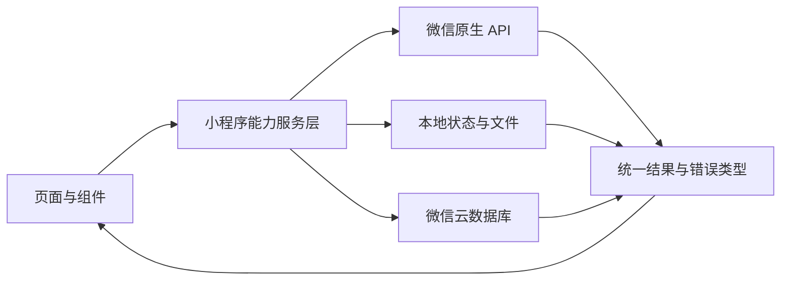

# 微信原生功能接入与实现优先级评估书

## 1. 文档定位

本文档是 Masterpiece 微信原生小程序的长期能力路线与实施优先级依据。当前及后续产品开发均以 `miniapp/` 为唯一主线，不要求 `src/` Web 端或其他平台同步实现。只有在明确启动其他平台开发时，才从已经验收的小程序能力、数据模型和交互规则反推跨端方案。

本文档负责管理方向、优先级、依赖关系、阶段门禁和验收原则。每项能力开始开发前，仍需创建独立实施子计划；具体代码步骤不写入本评估书，避免长期路线被短期实现细节拖累。

当前实施终点为 P0、P1、P2 全部完成。P3 仅作为未来候选记录，不建立任务、不安排工期、不影响当前阶段验收。

## 2. 当前项目基线

小程序当前已经具备以下微信原生能力：

- `wx.cloud.init`、`wx.cloud.database`：读取微信云数据库中的作品和画家数据。
- `wx.getStorageSync`、`wx.setStorageSync`：保存本机收藏、浏览历史、下载记录和关注画家。
- `wx.downloadFile`、`wx.saveImageToPhotosAlbum`：下载原图并保存至系统相册。
- `wx.navigateTo`、`wx.navigateBack`、`wx.switchTab`：完成页面和 Tab 导航。
- `wx.getImageInfo`、`wx.getWindowInfo`：计算图片和窗口尺寸。
- `wx.showToast`、`wx.showModal`、`wx.showLoading`、`wx.openSetting`：提供反馈和权限恢复入口。
- 下拉刷新、触底分页和输入法控制。
- `image`、`scroll-view`、`input`、`button`、`movable-area`、`movable-view` 等原生组件。
- `artwork-card`、`artwork-image`、`empty-state`、`error-state`、`skeleton-card` 等项目自定义组件。

当前主要缺口是：作品缺少全屏预览和平台分享，网络状态没有形成统一策略，下载记录没有对应应用内永久文件，用户数据仍以本机存储为主且没有微信身份和云同步闭环。

## 3. 全局原则

1. 只为 `miniapp/` 设计和实施，不为尚未启动的平台提前制造抽象。
2. 优先使用微信官方 API、组件和云开发能力，不引入不必要的第三方小程序框架。
3. 页面负责展示与交互，服务层负责微信 API、文件、网络、身份和同步逻辑。
4. 所有新增能力必须具备失败降级、自动化测试、开发者工具验收和真机验收。
5. 官方 API 接入前必须确认最低基础库、权限、服务器域名、云开发权限和审核影响。
6. `thumbnail_url` 用于列表，`display_url` 用于详情和预览，`download_url` 只用于用户主动下载。
7. P0 未通过阶段门禁前不进入 P1；P1 未稳定前不启动 P2。
8. 文件本地路径不跨设备同步；云端只同步业务记录、资源标识和可重建文件所需的元数据。
9. 不在小程序前端保存云开发管理密钥、服务端密钥或其他高权限凭据。

## 4. 优先级评估模型

### 4.1 评分维度

每项能力按 1–5 分评估，5 分代表最有利。实现成本和平台风险使用反向分：成本越低、风险越小，得分越高。

| 维度 | 权重 | 5 分含义 |
|---|---:|---|
| 用户价值 | 30% | 明显改善高频核心体验 |
| 核心流程关联度 | 25% | 直接属于发现、查看、保存、再次访问链路 |
| 稳定性收益 | 20% | 显著减少弱网、权限、文件或兼容问题 |
| 成本优势 | 15% | 实现、测试和维护成本较低 |
| 风险优势 | 10% | 平台、审核、权限和数据风险较小 |

综合分计算方式：

```text
综合分 = 用户价值×30% + 核心流程关联度×25% + 稳定性收益×20%
       + 成本优势×15% + 风险优势×10%
```

综合分用于判断能力价值，但不能替代依赖顺序。例如同步引擎的综合价值较高，仍必须等身份和云端安全模型完成后才能实施。

### 4.2 状态定义

能力在总评估书中使用以下状态：

```text
候选 → 已评估 → 已计划 → 实施中 → 已验收
                         ↘ 暂缓
```

- 候选：已记录，但尚未完成价值和风险评估。
- 已评估：评分、范围和依赖已经确定。
- 已计划：已有独立实施子计划和验收用例。
- 实施中：代码、配置或数据变更正在进行。
- 已验收：自动化、开发者工具和真机门禁全部通过。
- 暂缓：保留结论，但明确不进入当前实施批次。

## 5. P0–P2 能力评分矩阵

| 编号 | 能力 | 用户价值 | 核心关联 | 稳定收益 | 成本优势 | 风险优势 | 综合分 | 阶段 | 当前状态 |
|---|---|---:|---:|---:|---:|---:|---:|---|---|
| P0-01 | 官方能力兼容层 | 3 | 4 | 5 | 4 | 5 | 4.00 | P0 | 已评估 |
| P0-02 | 作品全屏预览 | 5 | 5 | 3 | 5 | 5 | 4.60 | P0 | 已评估 |
| P0-03 | 作品与画家分享 | 4 | 4 | 2 | 4 | 4 | 3.60 | P0 | 已评估 |
| P0-04 | 网络状态与大图策略 | 4 | 4 | 5 | 4 | 5 | 4.30 | P0 | 已评估 |
| P1-01 | 应用内永久文件服务 | 5 | 5 | 5 | 2 | 3 | 4.35 | P1 | 已评估 |
| P1-02 | 离线画册与下载记录升级 | 5 | 5 | 4 | 2 | 3 | 4.15 | P1 | 已评估 |
| P1-03 | 容量、清理与文件修复 | 3 | 4 | 5 | 3 | 4 | 3.75 | P1 | 已评估 |
| P2-01 | 微信身份与本地会话 | 4 | 4 | 4 | 2 | 2 | 3.50 | P2 | 已评估 |
| P2-02 | 用户云数据与安全规则 | 4 | 5 | 5 | 2 | 2 | 3.95 | P2 | 已评估 |
| P2-03 | 用户资料分阶段同步 | 5 | 5 | 5 | 1 | 2 | 4.10 | P2 | 已评估 |
| P2-04 | Profile 同步与隐私控制 | 4 | 3 | 4 | 3 | 3 | 3.50 | P2 | 已评估 |

## 6. P0：核心观看体验与平台可靠性

### 6.1 P0-01 官方能力兼容层

建立单一平台能力服务，集中处理：

- API 是否存在以及 `wx.canIUse` 判断。
- 最低基础库能力和降级分支。
- 微信错误对象到项目错误类型的转换。
- 开发者工具、真机和测试环境的差异。
- 诊断日志与用户提示的分离。

推荐服务边界为 `miniapp/services/platform-capabilities.js`。页面不得新增散落的版本判断；已有合理兼容逻辑可在对应功能改造时逐步迁入。

### 6.2 P0-02 作品全屏预览

作品详情页点击主图后调用 [`wx.previewImage`](https://developers.weixin.qq.com/miniprogram/dev/api/media/image/wx.previewImage.html)。预览图默认使用 `display_url`，不能因为进入详情或预览而请求 `download_url` 原图。

验收重点：

- 单张作品能够进入和退出系统预览。
- `display_url` 缺失时不调用预览，并提供明确提示。
- 图片加载失败不破坏详情页现有错误和骨架状态。
- 预览不改变收藏、历史和下载状态。

### 6.3 P0-03 作品与画家分享

作品详情和画家详情实现 `onShareAppMessage`。分享路径必须使用稳定作品或画家 ID，分享卡片标题、图片和路径由 `share-routes` 服务统一生成。朋友圈分享只有在目标基础库和产品条件满足时才启用，不作为 P0 通过的强制条件。

验收重点：

- 分享卡片包含正确标题和有效图片。
- 从分享卡片冷启动后直达正确详情。
- 目标内容不存在时进入可恢复错误状态。
- 分享路径不暴露本地文件路径、临时路径或敏感参数。

### 6.4 P0-04 网络状态与大图策略

封装 [`wx.getNetworkType`](https://developers.weixin.qq.com/miniprogram/dev/api/device/network/wx.getNetworkType.html) 和网络状态变化监听。网络服务向页面提供当前状态和订阅接口，页面不直接管理全局监听器。

策略如下：

- 断网浏览已有页面时保持当前内容，并提示网络状态。
- 断网发起远端加载或下载时快速失败，不展示无限加载。
- 移动网络下载原图时给出一次明确流量提示。
- 网络恢复后允许用户主动重试，不自动触发不可控的大图下载。
- 列表、详情和下载继续严格使用三级图片 URL。

### 6.5 P0 阶段门禁

- 预览功能在真实 Android 和 iOS 微信环境均可用。
- 作品和画家分享冷启动路径正确。
- 弱网、断网和网络恢复行为可解释且可重试。
- API 不支持时均有明确降级。
- P0 自动化测试、现有小程序回归和项目门禁全部通过。

## 7. P1：下载与应用内离线文件管理

### 7.1 P1-01 应用内永久文件服务

使用 [`wx.env.USER_DATA_PATH`](https://developers.weixin.qq.com/miniprogram/dev/api/base/wx.env.html) 和 [`wx.getFileSystemManager`](https://developers.weixin.qq.com/miniprogram/dev/api/file/wx.getFileSystemManager.html) 建立 `offline-files` 服务，负责：

- 从远端 URL 下载临时文件。
- 将临时文件移动或复制到应用内永久目录。
- 生成可预测但不依赖作品标题的安全文件名。
- 检查文件是否存在并读取基础文件信息。
- 删除单个文件和清理受控目录。
- 将微信文件错误转换为统一错误类型。

系统相册保存与应用内离线保存是两个独立动作。相册权限拒绝不能阻止应用内文件保存；应用内保存失败也不能伪造相册保存成功。

### 7.2 P1-02 离线画册与下载记录升级

现有下载记录升级为版本化结构，至少包含：

```js
{
  version: 2,
  artworkId: "stable-artwork-id",
  sourceUrl: "https://example.com/original.jpg",
  localFilePath: "wxfile://usr/offline-artworks/stable-name.jpg",
  fileSize: 123456,
  mimeType: "image/jpeg",
  status: "available",
  savedAt: "2026-07-16T00:00:00.000Z",
  checkedAt: "2026-07-16T00:00:00.000Z",
  errorCode: ""
}
```

允许的状态为：

- `downloading`：下载和永久写入尚未完成。
- `available`：记录和永久文件都可用。
- `missing`：记录存在但文件丢失。
- `failed`：最近一次保存失败，可由用户重试。

只有永久文件写入成功后才能标记为 `available`。下载管理页支持离线打开、重试、删除单项和清除无效记录。旧版仅元数据记录必须通过显式迁移转换，不能假定其对应文件仍然存在。

### 7.3 P1-03 容量、清理与文件修复

文件治理必须具备：

- 应用内离线目录的总容量统计。
- 保存前的容量检查和明确的空间不足提示。
- 删除记录时同步删除受控目录中的对应文件。
- 启动或进入下载管理页时执行轻量一致性检查。
- 用户主动执行完整检查时识别孤儿文件和失效记录。
- 清理动作必须限制在应用维护的离线目录内。

默认不自动删除用户仍标记为可用的离线作品。需要释放空间时，优先提示用户进入下载管理页选择清理，避免隐式淘汰造成信任问题。

### 7.4 P1 阶段门禁

- 关闭并重启小程序后仍能打开离线作品。
- 断网时可打开已保存文件，不能打开未保存作品时有明确提示。
- 删除、清空和修复不会产生受控目录内的孤儿文件。
- 记录与文件不一致时能够识别并恢复到可理解状态。
- 相册权限拒绝不影响应用内离线保存。
- 下载中断、空间不足和临时文件失效均有自动化测试与真机用例。

## 8. P2：微信身份与用户数据云同步

### 8.1 P2-01 微信身份与本地会话

建立 `user-session` 服务，负责：

- 获取当前微信云开发用户身份。
- 向页面提供明确的未识别、识别中、已识别和失败状态。
- 管理本次小程序会话内的用户标识，前端不自行伪造用户 ID。
- 退出或解除本机会话时保留用户明确选择的数据。

身份识别和用户资料授权是两个不同概念。不得为了获得头像或昵称而阻塞收藏、历史和同步等基础身份能力。

### 8.2 P2-02 用户云数据与安全规则

云端用户数据按当前用户隔离。集合至少覆盖：

- 收藏作品。
- 关注画家。
- 浏览历史。
- 下载记录元数据。

所有记录必须具备稳定业务主键、用户所有者、创建时间、更新时间和同步版本。云端安全规则必须保证用户只能读写自己的记录；管理端维护能力通过服务端权限实现，不能向小程序开放管理权限。

数据规则和索引先在隔离环境验证，再进入生产环境。P2 实施计划必须包含权限拒绝测试和跨用户隔离测试。

### 8.3 P2-03 用户资料分阶段同步

同步顺序固定为：

1. 收藏。
2. 关注画家。
3. 浏览历史。
4. 下载记录元数据。

每一类数据先实现只读拉取，再实现本地操作异步写云端，最后启用双向合并。前一类数据通过完整验收后才能开始下一类。

统一同步原则：

- 本地操作先落盘，云端同步不得阻塞浏览。
- 首次识别用户时默认合并本地数据和云端数据，不静默清空任何一侧。
- 集合型数据按稳定业务主键去重，以较新的有效更新时间合并。
- 删除使用可同步的删除标记或等价机制，避免离线删除在重新拉取后复活。
- 同步失败保留本地操作和可重试状态。
- 本地文件路径永远不上传，只同步作品 ID、来源 URL、文件元数据和保存状态摘要。

### 8.4 P2-04 Profile 同步与隐私控制

Profile 页面需要提供：

- 当前身份和同步状态。
- 最近同步时间及失败重试入口。
- 仅本机、等待同步、已同步等可理解状态。
- 退出当前会话。
- 清除本机数据、删除云端用户数据和同时删除的明确区分。
- 隐私说明及各类数据的用途说明。

破坏性操作必须二次确认，并在执行前明确影响范围。退出会话默认不删除本机收藏和离线文件；只有用户明确选择删除时才执行清理。

### 8.5 P2 阶段门禁

- 两个测试用户之间的数据完全隔离。
- 首次识别用户不会覆盖或丢失本机数据。
- 离线操作恢复联网后能够重试并完成同步。
- 同一用户在多设备上的集合型数据按规则合并。
- 删除记录不会在后续拉取中意外复活。
- 退出、清除本机和删除云端数据的范围符合界面说明。
- 权限规则、冲突处理、重试和隐私操作全部具备自动化及真机验收记录。

## 9. 技术分层与数据流



建议服务单元：

| 服务 | 责任 | 不承担的责任 |
|---|---|---|
| `platform-capabilities` | API 可用性、版本和错误归类 | 业务页面状态 |
| `network-status` | 网络快照、订阅和取消订阅 | 自动重试业务请求 |
| `share-routes` | 分享标题、图片和稳定路径 | 页面生命周期 |
| `offline-files` | 文件下载、保存、检查、删除和容量 | 收藏或历史业务记录 |
| `local-library` | 本地收藏、历史、关注、下载元数据 | 网络、身份和云端冲突 |
| `user-session` | 微信身份和本机会话状态 | 用户业务数据同步 |
| `user-library-sync` | 分类型同步、合并、删除和重试 | 页面渲染和本地文件传输 |

标准数据流：

1. 页面向服务传递标准化作品或画家 ID。
2. 服务调用微信 API、本地文件或云数据库。
3. 服务把回调、异常和数据转换为稳定结果。
4. 本地文件或数据真正写入成功后才更新持久化状态。
5. 页面只根据标准结果更新 `setData` 和用户反馈。

## 10. 统一错误模型

| 错误码 | 含义 | 用户侧处理 |
|---|---|---|
| `unsupported` | 基础库或 API 不支持 | 提示升级微信或使用降级功能 |
| `offline` | 当前无网络 | 保留当前内容并提供重试 |
| `permission-denied` | 用户拒绝相关权限 | 说明影响并提供设置入口 |
| `quota-exceeded` | 文件或存储额度不足 | 阻止写入并引导清理 |
| `file-missing` | 记录存在但文件丢失 | 标记失效并允许重新下载 |
| `remote-failed` | 下载或云数据库失败 | 保留本地状态并允许重试 |
| `invalid-data` | 本地或云端结构异常 | 隔离异常记录并记录诊断信息 |
| `unknown` | 未识别异常 | 使用通用提示并保留原始诊断信息 |

用户提示必须使用可理解的中文文案。诊断日志可以保留微信原始 `errMsg`，但不能直接把内部路径、用户标识或敏感数据展示给用户。

## 11. 测试与验收体系

### 11.1 功能进入开发前

- 对应微信官方文档和 API 已明确。
- 最低基础库要求和降级方案已明确。
- 权限、服务器域名、云集合和审核影响已明确。
- 输入、输出、持久化结构和错误类型已明确。
- 已创建独立实施子计划和可执行验收用例。

### 11.2 功能完成条件

- 服务层 Node 自动化测试通过，`wx` 能通过 mock 注入。
- 涉及页面的组件或页面逻辑测试通过。
- `node --test miniapp/**/*.test.mjs` 全量回归通过。
- 项目现有 `npm run check`、类型检查和构建门禁不退化。
- 微信开发者工具完成正常、弱网、断网和权限异常检查。
- 真实 Android 和 iOS 微信环境均至少完成一次验收。
- 回归清单、数据结构、限制和恢复方式已经更新。

### 11.3 阶段完成条件

阶段只有在该阶段所有能力状态均为“已验收”、全部阶段门禁通过且没有阻断级缺陷时才完成。非阻断 UI 问题进入现有小程序 UI 维护清单，不阻止阶段关闭。

## 12. 建议实施批次与子计划

总评估书批准后，按以下顺序创建并执行子计划：

1. `wechat-p0-platform-preview-network-share`：兼容层、作品预览、分享和网络策略。
2. `wechat-p1-offline-file-library`：永久文件服务、离线记录、下载管理和容量治理。
3. `wechat-p2-user-session-cloud-schema`：微信身份、用户集合、安全规则和隔离验证。
4. `wechat-p2-user-library-sync`：收藏、关注、偏好、历史和下载记录的分阶段同步。
5. `wechat-p2-profile-privacy-controls`：Profile 状态、重试、退出和数据删除边界。

每个子计划必须独立产生可测试、可验收的软件增量。不得在一个提交中同时跨越 P0、P1 或 P2 的阶段边界。

## 13. 风险登记表

| 风险 | 影响 | 缓解措施 | 阶段 |
|---|---|---|---|
| 基础库或机型行为差异 | API 在部分设备不可用 | 兼容层、最低版本、Android/iOS 真机矩阵 | P0 |
| 分享冷启动参数丢失 | 用户进入错误或空白页面 | 稳定 ID、启动参数测试、缺失内容错误态 | P0 |
| 大图造成高流量或长等待 | 下载中断和用户投诉 | 三级图片策略、网络提示、主动重试 | P0 |
| 临时路径被当作永久路径 | 重启后离线文件丢失 | 仅永久写入成功后标记可用 | P1 |
| 删除记录但遗留文件 | 存储持续增长 | 受控目录、原子化删除、一致性检查 | P1 |
| 清理越界删除其他文件 | 用户数据损坏 | 所有清理限定到应用维护目录 | P1 |
| 首次同步覆盖本机收藏 | 用户数据丢失 | 默认合并、去重、同步前快照与测试 | P2 |
| 云规则错误导致越权 | 用户隐私和安全事故 | 最小权限、跨用户拒绝测试、隔离环境验证 | P2 |
| 离线删除重新出现 | 用户无法信任同步结果 | 可同步删除标记和版本化冲突处理 | P2 |
| 浏览历史数据增长过快 | 配额和同步成本上升 | 本地与云端数量上限、批量同步和清理策略 | P2 |

## 14. P3 未来候选

以下能力不属于当前目标，不创建实施任务：

- 订阅消息和内容更新提醒。
- 客服、帮助与反馈闭环。
- `swiper`、富文本内容和更复杂的原生组件增强。
- 会员、实名认证和安全中心等业务系统。
- 小程序以外的平台适配。

只有在 P0–P2 完成或产品目标明确变化后，才重新评估这些能力。

## 15. 计划维护规则

1. 新需求先进入评分矩阵，再决定所属阶段和依赖关系。
2. 每项能力完成后更新状态、实际成本、遗留风险和下一项建议。
3. 阻断级缺陷可以打断路线；普通 UI 优化进入独立维护清单。
4. 微信政策、权限或 API 行为变化时，优先更新兼容层和本评估书。
5. 子计划不得擅自扩大阶段范围；需要扩展时先回到本评估书重新评估。
6. P3 保持未来候选状态，除非产品负责人重新批准。

## 16. 官方参考入口

- [`wx.env`](https://developers.weixin.qq.com/miniprogram/dev/api/base/wx.env.html)
- [`wx.getFileSystemManager`](https://developers.weixin.qq.com/miniprogram/dev/api/file/wx.getFileSystemManager.html)
- [`wx.previewImage`](https://developers.weixin.qq.com/miniprogram/dev/api/media/image/wx.previewImage.html)
- [`wx.downloadFile`](https://developers.weixin.qq.com/miniprogram/dev/api/network/download/wx.downloadFile.html)
- [`wx.saveImageToPhotosAlbum`](https://developers.weixin.qq.com/miniprogram/dev/api/media/image/wx.saveImageToPhotosAlbum.html)
- [`wx.getNetworkType`](https://developers.weixin.qq.com/miniprogram/dev/api/device/network/wx.getNetworkType.html)
- [微信小程序原生组件](https://developers.weixin.qq.com/miniprogram/dev/component/)
- [微信云开发](https://developers.weixin.qq.com/miniprogram/dev/wxcloud/basis/getting-started.html)

各子计划开始前必须重新核对对应官方页面，以当时有效的基础库、权限和审核要求为准。
